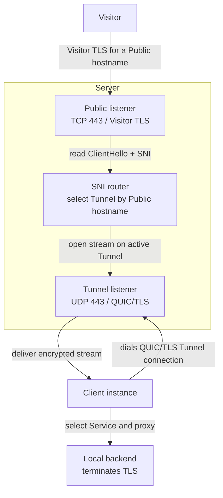

<div align="center">
  <h1>
    <picture>
      <source media="(prefers-color-scheme: dark)" srcset="assets/runewarp-horizontal-on-dark.svg">
      
    </picture>
  </h1>
  <p>
    <strong>
      Public ingress. Private by design.
    </strong>
  </p>
</div>

Runewarp is an ingress tunneling platform for securely exposing local services over outbound QUIC connections. Publish them without opening inbound ports or exposing your public IP, while preserving end-to-end TLS.

## Install

CLI from [crates.io](https://crates.io/crates/runewarp):
```bash
cargo install runewarp
```

Container image from [Docker Hub](https://hub.docker.com/r/runewarp/runewarp):
```bash
docker pull runewarp/runewarp
```

## Get started

Choose the path that matches what you want to do:

- **Evaluate locally:** follow the tested [Docker example](examples/docker/README.md)
- **Operate a self-hosted deployment:** use the [operator guide](docs/usage.md), then the [configuration reference](docs/configuration.md)
- **Managed protocol/specification:** use the normative [Managed-session protocol](docs/managed.md)
- **Understand the design:** start with [architecture](docs/architecture.md) and [security](docs/security.md)

## Goals

- **TLS passthrough ingress tunneling** — Server routes traffic by SNI without terminating TLS
- **Privacy-respecting by design** — Server never sees HTTP headers or application plaintext
- **Traverse NAT and firewalls** — Client uses outbound QUIC, so no port forwarding or public IP is required
- **Self-hostable and operator-controlled** — single Rust binary for both Client and Server
- **Remain operationally simple** — TOML config, a handful of CLI commands, no runtime dependencies

## Non-goals

- **Server TLS termination** — Server never decrypts or re-encrypts Visitor traffic
- **HTTP-layer routing** — no path-based routing, header inspection, or Layer 7 awareness of any kind

## Compatibility

Runewarp is pre-1.0. Patch releases aim to stay low-risk, but minor releases may include breaking CLI or configuration changes.

## Architecture



Visitors connect to the public server over TLS, and each client instance keeps one or more long-lived QUIC tunnel connections back to one or more configured server addresses. The server routes by SNI and forwards the encrypted stream to the selected client, which then proxies it to the local backend. A service can opt into terminate mode when the client, not the backend, should terminate TLS. See [`docs/architecture.md`](docs/architecture.md) for the detailed transport view.

## Comparison

How Runewarp compares to other tunnel tools:

### vs [ngrok](https://ngrok.com/)

A managed gateway focused on developer workflows, edge routing, and traffic policy.

- **Runewarp Server only operates on TLS:** no edge traffic policy, header inspection, or request transformation on the public Server.
- **ngrok edge-side workflows:** managed policy, routing, and developer ergonomics are part of the platform.

### vs [Cloudflare Tunnel](https://developers.cloudflare.com/tunnel/)

A managed connector into Cloudflare's edge, with routing and platform features built around that edge.

- **Runewarp is fully operator-run:** open source on both the Client and Server, self-hosted public ingress.
- **Cloudflare fits managed-edge workflows:** CDN, WAF, Access, DDoS protection, and other platform features come with the service.

### vs [Tailscale Funnel](https://tailscale.com/docs/features/tailscale-funnel)

A tailnet-based way to publish a local service publicly without exposing the device IP.

- **Runewarp works with custom domains:** explicit Server-side hostname ownership and no dependency on a tailnet, the Tailscale daemon, or `*.ts.net` names.
- **Funnel for existing Tailscale users:** the relay stays out of plaintext and the workflow is convenient when you already use that ecosystem.

### vs [rathole](https://github.com/rathole-org/rathole)

A simple, open-source client/server tunneling tool whose config model and simple client/server architecture helped inspire Runewarp.

- **Runewarp keeps routing explicit:** one QUIC/TLS Tunnel connection per Client instance and Server-authoritative routing by Public hostname. Configuration may be static or delivered over a separate Managed session to Control; Visitor traffic never shares that session.
- **rathole supports more protocols today:** service tokens, UDP forwarding, and more transport options.

## Documentation

### Start here

- [Docker example](examples/docker/README.md) — verify the complete topology locally
- [Operator guide](docs/usage.md) — install, configure, start, verify, and troubleshoot

### Operators

- [Configuration reference](docs/configuration.md) — config shapes, keys, defaults, and validation
- [Architecture](docs/architecture.md) — system structure, data paths, and current limits
- [Security](docs/security.md) — trust boundaries, visibility, certificates, and deployment trade-offs

### Protocol and Control implementers

- [Tunnel protocol](docs/protocol.md) — Tunnel wire behavior and runtime invariants
- [Managed-session protocol](docs/managed.md) — normative Control contract and interoperability checklist

### Contributors and maintainers

- [Contributing](CONTRIBUTING.md) — development checks and documentation expectations
- [Release guide](docs/release-guide.md) — human release and recovery runbook
- [Release automation](docs/release-automation.md) — CI, publication gates, and artifact lineage

### Roadmap

- [Roadmap](docs/roadmap.md) — forward-looking themes and live work

## License

Licensed under Apache License, Version 2.0 ([`LICENSE`](LICENSE)).
