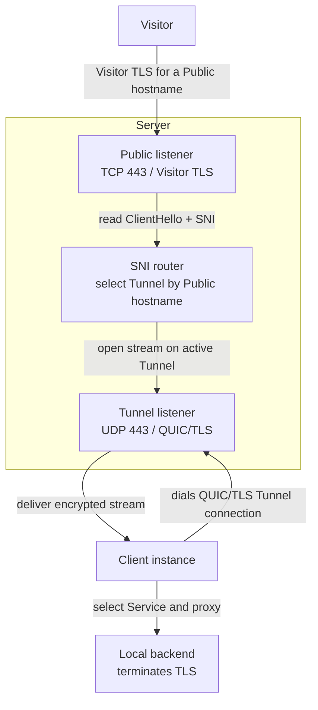

<div align="center">
  <h1>
    Runewarp
  </h1>
  <p>
    <strong>
      Public ingress. Private by design.
    </strong>
  </p>
</div>

Runewarp is an ingress tunneling tool for exposing local services without moving TLS termination to the edge. Clients connect out over QUIC, so you can publish services without putting your backend directly on the Internet or leaking your public IP.

## Goals

- **TLS passthrough ingress tunneling** — Server routes traffic by SNI without terminating or inspecting TLS
- **Privacy-respecting by design** — Server never sees HTTP headers or application plaintext
- **Traverse NAT and firewalls** — Client uses outbound QUIC, so no port forwarding or public IP is required
- **Self-hostable and operator-controlled** — single Rust binary for both Client and Server
- **Remain operationally simple** — TOML config, a handful of CLI commands, no runtime dependencies

## Non-goals

- **Server TLS termination** — Server never decrypts or re-encrypts Visitor traffic
- **HTTP-layer routing** — no path-based routing, header inspection, or Layer 7 awareness of any kind

## Install

Available from [crates.io](https://crates.io/crates/runewarp):
```bash
cargo install runewarp
```

Container image from [Docker Hub](https://hub.docker.com/r/runewarp/runewarp):
```bash
docker pull runewarp/runewarp
```

## Getting started

1. Read and run the Docker example [`examples/docker/README.md`](examples/docker/README.md).
2. Read [`docs/usage.md`](docs/usage.md) for the operator workflow.
3. Read [`docs/configuration.md`](docs/configuration.md) for config keys and examples.

## Architecture



Visitors connect to the public **Server** over TLS, and each **Client instance** maintains its own long-lived QUIC/TLS **Tunnel connection** back to it. After SNI-based **Tunnel** selection, the **Server** forwards the encrypted stream to the selected **Client instance**, which proxies it to the **Local backend**; a **Service** can also opt into **Terminate mode**. See [`docs/architecture.md`](docs/architecture.md) for the detailed transport view.

## Comparison

How Runewarp compares to other tunnel tools:

### vs [ngrok](https://ngrok.com/)

A managed cloud gateway focused on developer workflows, edge routing, and traffic policy.

- **Runewarp Server only operates on TLS:** no edge traffic policy, header inspection, or request transformation on the public **Server**.
- **ngrok edge-side workflows:** managed policy, routing, and developer ergonomics are part of the platform.

### vs [Cloudflare Tunnel](https://developers.cloudflare.com/tunnel/)

A managed connector into Cloudflare's edge, with routing and platform features built around that edge.

- **Runewarp is fully operator-run:** open source on both the **Client** and **Server**, self-hosted public ingress.
- **Cloudflare fits managed-edge workflows:** CDN, WAF, Access, DDoS protection, and other platform features come with the service.

### vs [Tailscale Funnel](https://tailscale.com/docs/features/tailscale-funnel)

A tailnet-based way to publish a local service publicly without exposing the device IP.

- **Runewarp works with custom domains:** explicit Server-side hostname ownership and no dependency on a tailnet, the Tailscale daemon, or `*.ts.net` names.
- **Funnel for existing Tailscale users:** the relay stays out of plaintext and the workflow is convenient when you already use that ecosystem.

### vs [rathole](https://github.com/rathole-org/rathole)

A simple, open-source client/server tunneling tool whose config model and simple client/server architecture helped inspire Runewarp.

- **Runewarp keeps routing explicit:** one QUIC/TLS **Tunnel connection** per **Client instance**, **Server-authoritative routing** by **Public hostname**, and no separate control channel.
- **rathole supports more protocols today:** service tokens, UDP forwarding, and more transport options.

## Documentation

| Document | Purpose |
| --- | --- |
| [`docs/usage.md`](docs/usage.md) | Guide for installation, setup, startup, verification, and troubleshooting |
| [`docs/configuration.md`](docs/configuration.md) | Configuration reference, defaults, and example configs |
| [`docs/architecture.md`](docs/architecture.md) | High-level design, routing model, trust boundaries, and topology diagrams |
| [`docs/security.md`](docs/security.md) | Visibility model, trust model, and security limits |
| [`docs/protocol.md`](docs/protocol.md) | Wire behavior and runtime invariants |
| [`docs/roadmap.md`](docs/roadmap.md) | Forward-looking roadmap and planned features |
| [`examples/docker/README.md`](examples/docker/README.md) | Walkthrough of the Docker example |

## License

Licensed under Apache License, Version 2.0 ([`LICENSE`](LICENSE)).
