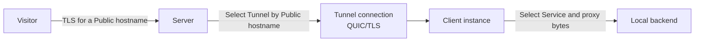

# Architecture

This document describes the committed Runewarp design: TLS passthrough on the public edge, Server-authoritative hostname routing, mutually authenticated tunnel connections, and Client-side forwarding to operator-run TLS backends.

## At a glance

| Concern | Runewarp design |
| --- | --- |
| Public traffic | TLS passthrough; the public edge does not terminate customer TLS |
| Routing authority | The **Server** selects the **Tunnel** from explicit Server-configured **Public hostnames** |
| Client behavior | The **Client** selects a **Service** locally and forwards traffic to a TLS-terminating **Local backend** |
| Tunnel transport | One long-lived QUIC/TLS **Tunnel connection** per **Client instance** |
| Trust model | Server certificate validation plus pinned **Client identity** authentication |

## Roles

| Component | Responsibility |
| --- | --- |
| **Visitor** | Connects to a **Public hostname** over TLS |
| **Server** | Accepts Visitor traffic, extracts SNI, selects a **Tunnel**, and forwards the original encrypted stream |
| **Client instance** | Maintains one **Tunnel connection**, selects a **Service**, and forwards traffic to a **Local backend** |
| **Local backend** | Terminates TLS and serves the operator application |

## End-to-end flow

Runewarp adds no routing header to public traffic. The forwarded byte stream begins with the Visitor's original ClientHello and stays encrypted until the Local backend terminates TLS.

## Routing authority

Runewarp keeps ingress authority on the **Server**:

- every Server `[[tunnels]]` entry lists explicit **Public hostnames**
- the Server routes only those hostnames into a **Tunnel**
- the Client does not register hostnames with the Server
- hostname overlap is rejected within Server **Tunnels** and within Client **Services**

This keeps public hostname ownership explicit even when the Client chooses a different local routing shape.

## Routing topologies

| Topology | Server side | Client side | Use when |
| --- | --- | --- | --- |
| **Hostname mirroring** | Explicit **Public hostnames** on each **Tunnel** | Explicit **Public hostnames** on each **Service** | The Client needs per-host local routing decisions |
| **One-sided Catch-all** | Explicit **Public hostnames** on each **Tunnel** | One sole **Service** with no `public-hostnames` | One backend should receive every hostname the Server already authorized for that Tunnel |

In both shapes, the Server remains the routing authority for public ingress.

## Data path

1. A **Visitor** connects to `443/tcp` on the **Server**.
2. The Server buffers enough of the ClientHello to extract SNI.
3. The Server rejects non-TLS traffic, missing-SNI traffic, and non-ACME application traffic addressed to the **Server hostname**.
4. The Server selects a **Tunnel** by exact **Public hostname**.
5. If that Tunnel has no active **Tunnel connection**, the Server drops the connection.
6. Otherwise, the Server forwards the original encrypted bytes over the selected Tunnel connection.
7. The receiving **Client instance** re-reads the forwarded ClientHello, selects a **Service**, and connects to the **Local backend**.
8. If no Client Service matches, the Client rejects the stream.
9. The Local backend terminates TLS and serves the application.

## Stream lifecycle seams

Runewarp keeps the per-stream choreography concentrated behind two concrete modules:

- the **Server** hands each accepted **Visitor** TCP stream to one handler that owns ClientHello parsing, **Server hostname** ACME handling, **Public hostname** authorization, **Tunnel** lookup, drop logging, and forwarding
- the **Client** hands each inbound **Tunnel connection** stream to one handler that owns forwarded ClientHello parsing, **Service** selection, rejection, **Local backend** dialing, and forwarding
- the outer runtimes stay thin callers; intermediate routing or backend-resolution result types do not cross those seams

## Trust model

| Trust boundary | Design |
| --- | --- |
| **Server hostname** | Identifies the public Runewarp edge, not the operator application |
| **Server certificate** | Protects the tunnel endpoint and is validated by the Client |
| **Server CA** | Optional private trust anchor for the manual Server-certificate path |
| **Client identity** | Pinned public-key identity used to authenticate the Client to the Server |
| **Public hostname authorization** | Owned by Server config through explicit `server.tunnels[].public-hostnames` |

The Client validates the Server certificate either through system trust or through the exclusive configured `server-ca-file`. The Server authenticates the pinned `client-identity` from the Client public key rather than from a certificate lifetime.

## Runtime shape

- each **Client instance** establishes exactly one **Tunnel connection**
- the runtime keeps one active connection per **Tunnel**
- a newer authenticated connection replaces the older one only inside that same **Tunnel**
- multiple Client instances across different Tunnels are supported
- same-Tunnel load-balanced pools are not part of the current runtime shape

## Product boundaries

- TLS passthrough is the product boundary
- customer TLS is terminated only on the **Local backend**
- plain HTTP backends are out of scope
- edge TLS termination for customer traffic is out of scope
