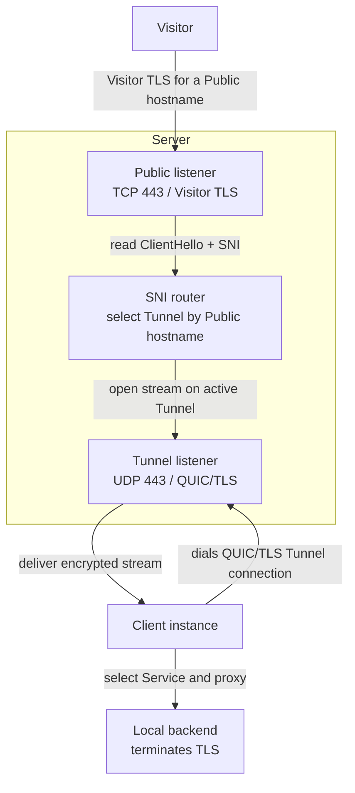

# Architecture

Runewarp keeps public ingress simple: the server routes encrypted traffic to a client, and the backend still terminates TLS unless a service opts into client-side termination.

## Summary

| Concern | Runewarp design |
| --- | --- |
| Public traffic | TLS passthrough by default; the public edge does not terminate customer TLS |
| Routing authority | The **Server** selects the **Tunnel** from explicit Server-configured **Public hostnames** |
| **Client instance behavior** | The **Client instance** selects a **Service** locally and either forwards TLS bytes to a TLS-terminating **Local backend** (**TLS passthrough**) or terminates TLS itself before proxying plaintext to the **Local backend** (**Terminate mode**) |
| Tunnel transport | One long-lived QUIC/TLS **Tunnel connection** per **Client instance** |
| Trust model | Server certificate validation plus pinned **Client identity** authentication |

## Roles

| Component | Responsibility |
| --- | --- |
| **Visitor** | Connects to a **Public hostname** over TLS |
| **Server** | Accepts Visitor traffic, extracts SNI, selects a **Tunnel**, and forwards the original encrypted stream |
| **Client instance** | Maintains one or more **Tunnel connections**, selects a **Service**, and forwards traffic to a **Local backend** |
| **Local backend** | Terminates TLS under **TLS passthrough** or receives plaintext in **Terminate mode** and serves the operator application |

## Config handling

Runewarp prepares config in three steps:

1. Select the active config input, apply CLI overrides where allowed, and resolve defaults and config-relative paths.
2. Validate routing, trust, and mutual-exclusion rules against the prepared config.
3. Perform startup side effects only after validation succeeds.

Runtime commands request a full prepared-and-validated **Server** or **Client** config from Config preparation. Material-management commands request command-specific outcomes from the same seam (material directories, Server hostname, terminating Public hostnames, managed-mode detection) without reopening raw config sections or coordinating parsing helpers themselves.

This keeps config discovery and defaulting predictable without mixing them into startup side effects.

## Hostname domain values

Runewarp turns hostname input into opaque canonical domain values at the first validation seam:

- `server.hostname`, the host portion of `client.server-address`, and the host portion of each `client.server-addresses[]` entry become **Server hostname** values
- `server.tunnels[].public-hostnames`, `client.services[].public-hostnames`, and parsed ClientHello SNI become **Public hostname** values
- lowercase normalization and trailing-dot stripping happen before duplicate detection and route lookup

After a hostname crosses that seam, routing and service-selection code carries the typed value instead of raw strings. That keeps normalization, equality, and hashing rules in one place while preserving the domain distinction between the public routed hostname and the Runewarp edge hostname.

## End-to-end flow

In passthrough mode, the forwarded byte stream stays encrypted until the local backend terminates TLS. In terminate mode, the client terminates TLS and proxies plaintext TCP to the backend.

## Routing model

Runewarp keeps public routing authority on the server:

- every Server `[[tunnels]]` entry lists explicit **Public hostnames**
- the Server routes only those hostnames into a **Tunnel**
- the Client does not register hostnames with the Server
- hostname overlap is rejected within Server **Tunnels** and within Client **Services**

That keeps public hostname ownership explicit even when the client uses a different local routing shape.

## Supported routing shapes

| Shape | Server side | Client side | Use when |
| --- | --- | --- | --- |
| **Hostname mirroring** | Explicit **Public hostnames** on each **Tunnel** | Explicit **Public hostnames** on each **Service** | The Client needs per-host local routing decisions |
| **Client with a Catch-all Service** | Explicit **Public hostnames** on each **Tunnel** | One sole **Service** with no `public-hostnames` | One backend should receive every hostname the Server already authorized for that Tunnel |

Both shapes still use **Server-authoritative routing** for public ingress.

## Data path

### Passthrough (default)

1. A **Visitor** connects to the **Server** on its configured public TCP listener, `server.public-bind-address`, which defaults to `0.0.0.0:443`.
2. The Server buffers enough of the ClientHello to extract SNI.
3. The Server rejects non-TLS traffic, missing-SNI traffic, and non-ACME application traffic addressed to the **Server hostname**.
4. The Server selects a **Tunnel** by exact **Public hostname**.
5. If that Tunnel has no active **Tunnel connection**, the Server drops the connection.
6. Otherwise, the Server forwards the original encrypted bytes over the selected Tunnel connection.
7. The receiving **Client instance** re-reads the forwarded ClientHello, selects a **Service**, and connects to the **Local backend**.
8. If no Client Service matches, the Client rejects the stream.
9. The Local backend terminates TLS and serves the application.

### Terminate (opt-in per Service)

Steps 1–8 are the same. In step 7, when the matched Service has `tls-mode = "terminate"`:

7a. The Client completes the TLS handshake with the Visitor using the per-hostname leaf certificate — from `client.public-cert-dir` (manual path) or from `[client.acme]` (ACME path). In Client ACME mode the **Client instance** owns one live ACME manager per terminating **Public hostname** for the process lifetime, shared across independent Server-address workers and Tunnel-connection reconnects, and does not block startup on certificate readiness; a hostname without a ready certificate fails closed at the TLS handshake with no fallback to passthrough.
7b. The Client connects to the Local backend in plaintext TCP.
7c. The Client proxies decrypted data between the TLS stream and the plaintext backend connection.

The Local backend receives unencrypted bytes directly and does not need to terminate TLS.

## Trust model

| Trust boundary | Design |
| --- | --- |
| **Server hostname** | Identifies the public Runewarp edge, not the operator application |
| **Server certificate** | Protects the tunnel endpoint and is validated by the Client |
| **Server CA** | Optional private trust anchor for the manual Server-certificate path |
| **Client identity** | Pinned public-key identity used to authenticate the Client to the Server; each Tunnel may authorize one or more of them |
| **Public hostname authorization** | Owned by the current **Authorization snapshot**: static `server.tunnels[].public-hostnames` at startup, or Control-published Server snapshots in **Managed mode** |
| **Authorization snapshot** | Immutable Server-owned set of Public-hostname routing and trusted Client identities; Public-hostname routing and QUIC Client-identity handshake admission consult the same current snapshot |
| **Managed session** | Authenticated Control relationship for versioned full-input snapshots and revision-only applied-state acknowledgments; separate from **Server readiness**, Visitor traffic, and **Tunnel connections** (see [`managed.md`](managed.md)) |
| **Public hostname CA** (manual) | Private trust anchor in `client.public-cert-dir` shared with Visitors when `tls-mode = "terminate"` is in use |
| **Public hostname certificates via Client ACME** | Automatically provisioned by Let's Encrypt via `[client.acme]` for **Public hostnames** of terminating Services; `acme-tls/1` challenge traffic for those hostnames is routed through the Server to the Client like ordinary Visitor TLS |

The client validates the server certificate either through system trust or through `client.server-trust = "ca-file"` with an exclusive CA bundle. The server authenticates one of the Tunnel's pinned `client-identity` values from the client public key rather than the certificate lifetime. Static Server startup loads one **Authorization snapshot** shared by Public-hostname routing and the live QUIC Client-identity verifier; a prepared replacement can be validated beside the live snapshot and committed atomically without exposing a mixed view. Static Client startup seeds one **Address controller** from the configured **Server addresses**; the controller owns the complete assigned Server-address lifecycle (workers, Retiring, static Client-ready, shutdown) while preserving today's reconnect and traffic behavior. Validated Services, Terminate-mode TLS resolver state, and Client ACME managers are prepared once for the **Client instance** and reused by those workers; each Tunnel-connection attempt still reloads Server trust and Client identity material. In **Managed mode**, each runtime also maintains one role-neutral **Managed session** over mutually authenticated HTTP/2. Role adapters apply Control-published authorization or Server-address assignment through the same snapshot and Address-controller seams; readiness, Retiring, convergence, Control-loss retention, and drain interaction are specified in [`managed.md`](managed.md).

## Current runtime limits

- public pre-routing work is bounded to 4,096 concurrent ClientHellos globally and 256 per accepted peer IP, with a 5-second ClientHello completion deadline in addition to the 16 KB byte limit
- the accepted socket peer IP is the only per-source admission identity; deployments behind a load balancer share that load balancer IP's bucket, and Core does not infer source identity from forwarded headers
- concurrent Server-side QUIC handshakes are bounded to 256 before per-handshake work is spawned
- pending Server `open_bi()` opens are bounded to 1,024 with a 5-second open deadline; active routed Visitor streams are bounded to 4,096 and tracked in a keyed map for selective Authorization revocation
- active **Tunnel connections** are bounded to 4,096 globally, 256 per **Tunnel pool**, and 64 per authenticated **Client identity**; saturation rejects the newest connection without replacing healthy members
- each **Client instance** enforces one aggregate stream-handler budget of 1,024 across all live **Tunnel connections**, and advertises at most 1,024 Server-opened bidirectional QUIC streams per connection so one connection cannot request more than the instance budget; the shared semaphore remains authoritative when multiple connections compete
- Client routed-stream setup uses 5-second deadlines for tunneled ClientHello completion, backend connect, initial backend write, Terminate-mode TLS handshake, and ACME challenge TLS handshake; successfully established proxies remain long-lived without a new idle or lifetime deadline
- transient public-listener accept errors retry with backoff from 10 ms to 1 s; unrecoverable listener failures remain fatal and drop readiness
- each **Client instance** establishes one or more **Tunnel connections**
- static Client startup seeds one **Address controller** from the configured **Server addresses**; the controller owns the complete assigned Server-address lifecycle and allows maintenance intent to be replaced (add / remove / re-adopt) without process restart
- managed Server and Client runtimes maintain one **Managed session** to Control; the wire contract, schemas, readiness/Retiring/convergence rules, input/reporting limits, and failure taxonomy are in [`managed.md`](managed.md)
- Managed-session SSE lines, event types, event data, snapshot bytes, decoded allocation, Tunnel/Public-hostname/Client-identity/Server-address cardinalities, and applied-state request/response deadlines are fixed production limits documented in [`managed.md`](managed.md); oversized input fails the session without partial apply
- static and managed modes are mutually exclusive at startup: static-to-managed and managed-to-static changes require configuration replacement plus process restart, with no overlapping sources or in-process mode switch
- in static Client mode, Client-ready means at least one configured **Server address** is connected; managed Client mode reports **Assignment convergence** instead and does not emit the static one-shot Client-ready event
- failure of one configured **Server address** does not tear down healthy **Tunnel connections** to other configured **Server addresses**
- a **Tunnel** stays available while at least one authenticated **Tunnel connection** is live
- when a **Tunnel** has more than one live **Tunnel connection** on one **Server** node, the runtime treats them as a **Tunnel pool**
- new Visitor streams are placed onto the least-busy **Tunnel pool** member, with round-robin tie-breaking when active-stream load is equal
- once placed, a proxied stream stays on its chosen **Tunnel connection** until it closes or that connection dies
- multiple Client instances across different Tunnels are supported
- optional **Server readiness** is ingress-admission-only: when `server.readiness-bind-address` is configured, a probe-only TCP listener stays up only while the Server should admit new ingress traffic
- orderly local shutdown is runtime-owned: the **Server** drops **Server readiness** immediately, stops accepting new Visitor traffic, new **Tunnel connections**, and new streams on already-open **Tunnel connections**, while the **Client instance** stops reconnect work before closing its active **Tunnel connection**
- **Graceful shutdown** on the **Server** keeps already-landed Visitor streams alive only up to `server.graceful-shutdown-duration`, then force-closes remaining work
- **Fast shutdown** on the **Server** skips that longer drain window
- the short **QUIC close flush duration** remains a fixed runtime-owned courtesy window after the close frame is sent; it is not an operator-facing drain knob
- TLS passthrough is the default and lowest-privilege mode
- customer TLS is terminated either on the **Local backend** (passthrough) or on the **Client instance** (terminate)
- plain HTTP backends require `tls-mode = "terminate"` on the matching Service
- the server does not terminate customer TLS
