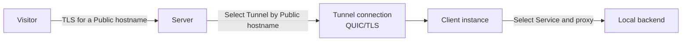

# Architecture

This document describes the committed Runewarp design: TLS passthrough on the public edge by default, Server-authoritative hostname routing, mutually authenticated tunnel connections, and Client-side forwarding to operator-run TLS backends. Client-side TLS termination is opt-in per Service.

## At a glance

| Concern | Runewarp design |
| --- | --- |
| Public traffic | TLS passthrough by default; the public edge does not terminate customer TLS |
| Routing authority | The **Server** selects the **Tunnel** from explicit Server-configured **Public hostnames** |
| Client behavior | The **Client** selects a **Service** locally and either forwards TLS bytes to a TLS-terminating **Local backend** (passthrough) or terminates TLS itself before proxying plaintext to the **Local backend** (terminate) |
| Tunnel transport | One long-lived QUIC/TLS **Tunnel connection** per **Client instance** |
| Trust model | Server certificate validation plus pinned **Client identity** authentication |

## Roles

| Component | Responsibility |
| --- | --- |
| **Visitor** | Connects to a **Public hostname** over TLS |
| **Server** | Accepts Visitor traffic, extracts SNI, selects a **Tunnel**, and forwards the original encrypted stream |
| **Client instance** | Maintains one **Tunnel connection**, selects a **Service**, and forwards traffic to a **Local backend** |
| **Local backend** | Terminates TLS (passthrough mode) or receives plaintext (terminate mode) and serves the operator application |

## End-to-end flow

In **passthrough** mode (default), the forwarded byte stream begins with the Visitor's original ClientHello and stays encrypted until the Local backend terminates TLS. In **terminate** mode, the Client terminates TLS using its own certificate material and proxies plaintext TCP to the Local backend.

## Routing authority

Runewarp keeps ingress authority on the **Server**:

- every Server `[[tunnels]]` entry lists explicit **Public hostnames**
- the Server routes only those hostnames into a **Tunnel**
- the Client does not register hostnames with the Server
- hostname overlap is rejected within Server **Tunnels** and within Client **Services**

This keeps public hostname ownership explicit even when the Client chooses a different local routing shape.

## Routing topologies

| Topology | Server side | Client side | Use when |
| --- | --- | --- | --- |
| **Hostname mirroring** | Explicit **Public hostnames** on each **Tunnel** | Explicit **Public hostnames** on each **Service** | The Client needs per-host local routing decisions |
| **One-sided Catch-all** | Explicit **Public hostnames** on each **Tunnel** | One sole **Service** with no `public-hostnames` | One backend should receive every hostname the Server already authorized for that Tunnel |

In both shapes, the Server remains the routing authority for public ingress.

## Data path

### Passthrough (default)

1. A **Visitor** connects to the **Server** on its configured public TCP listener, `server.public-bind-address`, which defaults to `0.0.0.0:443`.
2. The Server buffers enough of the ClientHello to extract SNI.
3. The Server rejects non-TLS traffic, missing-SNI traffic, and non-ACME application traffic addressed to the **Server hostname**.
4. The Server selects a **Tunnel** by exact **Public hostname**.
5. If that Tunnel has no active **Tunnel connection**, the Server drops the connection.
6. Otherwise, the Server forwards the original encrypted bytes over the selected Tunnel connection.
7. The receiving **Client instance** re-reads the forwarded ClientHello, selects a **Service**, and connects to the **Local backend**.
8. If no Client Service matches, the Client rejects the stream.
9. The Local backend terminates TLS and serves the application.

### Terminate (opt-in per Service)

Steps 1–8 are the same. In step 7, when the matched Service has `tls-mode = "terminate"`:

7a. The Client completes the TLS handshake with the Visitor using the per-hostname leaf certificate from `client.public-cert-dir`.
7b. The Client connects to the Local backend in plaintext TCP.
7c. The Client proxies decrypted data between the TLS stream and the plaintext backend connection.

The Local backend receives unencrypted bytes directly and does not need to terminate TLS.

## Trust model

| Trust boundary | Design |
| --- | --- |
| **Server hostname** | Identifies the public Runewarp edge, not the operator application |
| **Server certificate** | Protects the tunnel endpoint and is validated by the Client |
| **Server CA** | Optional private trust anchor for the manual Server-certificate path |
| **Client identity** | Pinned public-key identity used to authenticate the Client to the Server |
| **Public hostname authorization** | Owned by Server config through explicit `server.tunnels[].public-hostnames` |
| **Client public-cert CA** | Manual trust anchor shared with Visitors when `tls-mode = "terminate"` is in use |

The Client validates the Server certificate either through system trust or through `client.server-trust = "ca-file"` with an exclusive CA bundle. The Server authenticates the pinned `client-identity` from the Client public key rather than from a certificate lifetime.

## Runtime shape

- each **Client instance** establishes exactly one **Tunnel connection**
- the runtime keeps one active connection per **Tunnel**
- a newer authenticated connection replaces the older one only inside that same **Tunnel**
- multiple Client instances across different Tunnels are supported
- same-Tunnel load-balanced pools are not part of the current runtime shape

## Product boundaries

- TLS passthrough is the default and the lowest-privilege mode
- customer TLS may be terminated on the **Local backend** (passthrough, default) or on the **Client** (terminate, opt-in)
- plain HTTP backends require `tls-mode = "terminate"` on the matching Service
- edge TLS termination managed by the Server for customer traffic is out of scope
