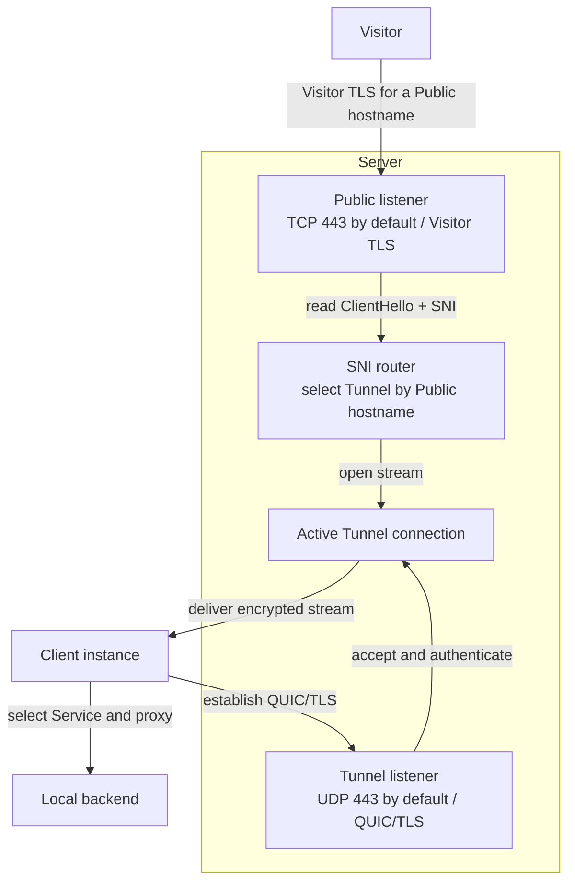

# Architecture

Runewarp keeps public ingress simple: the server routes encrypted traffic to a client, and the backend still terminates TLS unless a service opts into client-side termination.

## Summary

| Concern | Runewarp design |
| --- | --- |
| Public traffic | TLS passthrough by default; the public edge does not terminate customer TLS |
| Visitor addresses | Direct sockets or trusted PROXY v2 ingress become one canonical TCP tuple carried on every Tunnel stream |
| Routing authority | The **Server** selects the **Tunnel** from the current **Authorization snapshot** |
| **Client instance behavior** | The **Client instance** selects a **Service** locally and either forwards TLS bytes to a TLS-terminating **Local backend** (**TLS passthrough**) or terminates TLS itself before proxying plaintext to the **Local backend** (**Terminate mode**) |
| Tunnel transport | One long-lived QUIC/TLS **Tunnel connection** per effective **Server address** |
| Trust model | Server certificate validation plus pinned **Client identity** authentication |
| Process lifecycle | Separate Client and Server role runtimes own preparation, static/Managed construction, ACME, shutdown, fatal propagation, and teardown |

## Roles

| Component | Responsibility |
| --- | --- |
| **Visitor** | Connects to a **Public hostname** over TLS |
| **Server** | Accepts Visitor traffic, extracts SNI, selects a **Tunnel**, and forwards the original encrypted stream |
| **Client instance** | Maintains one or more **Tunnel connections**, selects a **Service**, and forwards traffic to a **Local backend** |
| **Local backend** | Terminates TLS under **TLS passthrough** or receives plaintext in **Terminate mode** and serves the operator application |

Server ingress and backend emission are independent. An opted-in Service receives a regenerated PROXY v2 header before TLS bytes in passthrough mode or before plaintext in Terminate mode. Other Services receive no header.

## Config handling

Runewarp prepares config in three steps:

1. Select the active config input, apply CLI overrides where allowed, and resolve defaults and config-relative paths.
2. Validate routing, trust, and mutual-exclusion rules against the prepared config.
3. Perform startup side effects only after validation succeeds.

Runtime commands request a full prepared-and-validated **Server** or **Client** config from Config preparation. Material-management commands request command-specific outcomes from the same seam (material directories, Server hostname, terminating Public hostnames, managed-mode detection) without reopening raw config sections or coordinating parsing helpers themselves.

This keeps config discovery and defaulting predictable without mixing them into startup side effects.

After Config preparation, the binary is only a process adapter: it translates CLI input and
operating-system signals, then crosses one `ClientRuntime` or `ServerRuntime` library seam. The
separate role runtimes own startup side effects, static-versus-Managed construction, optional ACME
work, child-runtime completion, orderly shutdown, and teardown. Client and Server deliberately do
not share a generic runtime framework because their drain and Managed-session lifetimes differ.
The crate-root `ClientRuntime` and `ServerRuntime` exports are the supported process-integration
surface. CLI-only lifecycle mechanics stay private. The remaining crate-root startup, transport,
and controller exports are intentional lower-level library and integration-test surfaces; they do
not participate in process orchestration.

## Hostname domain values

Runewarp turns hostname input into opaque canonical domain values at the first validation seam:

- `server.hostname`, the host portion of `client.server-address`, and the host portion of each `client.server-addresses[]` entry become **Server hostname** values
- `server.tunnels[].public-hostnames`, `client.services[].public-hostnames`, and parsed ClientHello SNI become **Public hostname** values
- lowercase normalization and trailing-dot stripping happen before duplicate detection and route lookup

After a hostname crosses that seam, routing and service-selection code carries the typed value instead of raw strings. That keeps normalization, equality, and hashing rules in one place while preserving the domain distinction between the public routed hostname and the Runewarp edge hostname.

## End-to-end flow

```mermaid
flowchart TD
    V[Visitor]
    C["Client instance"]
    B["Local backend"]

    subgraph S["Server"]
        direction TB
        P["Public listener<br/>TCP 443 by default / Visitor TLS"]
        R["SNI router<br/>select Tunnel by Public hostname"]
        U["Tunnel listener<br/>UDP 443 by default / QUIC/TLS"]
        T["Active Tunnel connection"]

        P -->|"read ClientHello + SNI"| R
        U -->|"accept and authenticate"| T
        R -->|"open stream"| T
    end

    V -->|"Visitor TLS for a Public hostname"| P
    C -->|"establish QUIC/TLS"| U
    T -->|"deliver encrypted stream"| C
    C -->|"select Service and proxy"| B
```

In passthrough mode, the forwarded byte stream stays encrypted until the local backend terminates TLS. In terminate mode, the client terminates TLS and proxies plaintext TCP to the backend.

## Routing model

Runewarp keeps public routing authority on the server:

- every static Server `[[server.tunnels]]` entry lists explicit **Public hostnames**; Managed mode receives the same authorization from Control
- the Server routes only those hostnames into a **Tunnel**
- the Client does not register hostnames with the Server
- hostname overlap is rejected within Server **Tunnels** and within Client **Services**

That keeps public hostname ownership explicit even when the client uses a different local routing shape.

## Supported routing shapes

| Shape | Server side | Client side | Use when |
| --- | --- | --- | --- |
| **Hostname mirroring** | Explicit **Public hostnames** on each **Tunnel** | Explicit **Public hostnames** on each **Service** | The Client needs per-host local routing decisions |
| **Client with a Catch-all Service** | Explicit **Public hostnames** on each **Tunnel** | One sole **Service** with no `public-hostnames` | One backend should receive every hostname the Server already authorized for that Tunnel |

Both shapes still use **Server-authoritative routing** for public ingress.

## Data path

### Passthrough (default)

1. A **Visitor** connects to the **Server** on its configured public TCP listener, `server.public-bind-address`, which defaults to `0.0.0.0:443`.
2. One Server Visitor-intake module owns global admission, trusted direct-or-strict-PROXY tuple resolution, canonical-source admission, the shared intake deadline, ClientHello parsing, permit release, shutdown cancellation, and rejection/recovery reporting.
3. The Server buffers enough of the ClientHello to extract SNI.
4. The Server rejects non-TLS traffic, missing-SNI traffic, and non-ACME application traffic addressed to the **Server hostname**.
5. The Server selects a **Tunnel** by exact **Public hostname**.
6. If that Tunnel has no active **Tunnel connection**, the Server drops the connection.
7. Otherwise, one Tunnel-framing module writes the canonical Visitor tuple followed by the original encrypted bytes over the selected Tunnel connection.
8. The receiving **Client instance** crosses the same framing seam to validate and consume the tuple before re-reading the forwarded ClientHello, selecting a **Service**, and connecting to the **Local backend**.
9. If no Client Service matches, the Client rejects the stream.
10. The Local backend terminates TLS and serves the application.

### Terminate (opt-in per Service)

Steps 1–9 are the same. In step 8, when the matched Service has `tls-mode = "terminate"`:

8a. The Client completes the TLS handshake with the Visitor using the per-hostname leaf certificate — from `client.public-cert-dir` (manual path) or from `[client.acme]` (ACME path). In Client ACME mode the **Client instance** owns one live ACME manager per terminating **Public hostname** for the process lifetime, shared across independent Server-address workers and Tunnel-connection reconnects, and does not block startup on certificate readiness; a hostname without a ready certificate fails closed at the TLS handshake with no fallback to passthrough.
8b. The Client connects to the Local backend in plaintext TCP.
8c. The Client proxies decrypted data between the TLS stream and the plaintext backend connection.

The Local backend receives unencrypted bytes directly and does not need to terminate TLS.

The Tunnel-framing module owns the complete internal `runewarp/1` application-stream envelope on both ends. **Backend PROXY emission** remains a distinct per-Service seam and only reuses the PROXY v2 codec internally.

## Trust model

| Trust boundary | Design |
| --- | --- |
| **Server hostname** | Identifies the public Runewarp edge, not the operator application |
| **Server certificate** | Protects the tunnel endpoint and is validated by the Client |
| **Server CA** | Optional private trust anchor for the manual Server-certificate path |
| **Client identity** | Pinned public-key identity used to authenticate the Client to the Server; each Tunnel may authorize one or more of them |
| **Public hostname authorization** | Owned by the current **Authorization snapshot**: static `server.tunnels[].public-hostnames` at startup, or Control-published Server snapshots in **Managed mode** |
| **Authorization snapshot** | Immutable Server-owned set of Public-hostname routing and trusted Client identities; Public-hostname routing and QUIC Client-identity handshake admission consult the same current snapshot. Static snapshots have no Tunnel ID; managed snapshots carry Tunnel IDs as pool continuity keys |
| **Managed session** | Authenticated Control relationship for versioned full-input snapshots and revision-only applied-state acknowledgments; separate from **Server readiness**, Visitor traffic, and **Tunnel connections** (see [`managed.md`](managed.md)) |
| **Public hostname CA** (manual) | Private trust anchor in `client.public-cert-dir` shared with Visitors when `tls-mode = "terminate"` is in use |
| **Public hostname certificates via Client ACME** | Automatically provisioned by Let's Encrypt via `[client.acme]` for **Public hostnames** of terminating Services; `acme-tls/1` challenge traffic for those hostnames is routed through the Server to the Client like ordinary Visitor TLS |

The Client validates the Server certificate through system trust or an exclusive CA bundle. The Server authenticates a pinned **Client identity** from the Client public key rather than the certificate lifetime.

In **Static mode**, the Server loads one startup-only **Authorization snapshot** and the Client starts one address worker per configured **Server address**. In **Managed mode**, Control replaces the same complete authorization or assignment inputs. Server replacement commits routing and handshake admission together and preserves Tunnel-pool continuity by **Tunnel ID**; Client replacement adds, Retires, or re-adopts address workers without duplicate dialing.

Each Managed runtime maintains one mutually authenticated HTTP/2 **Managed session**. The full apply, readiness, convergence, Retiring, Control-loss, and drain contract is in [`managed.md`](managed.md).

## Operational boundaries

- Visitor intake, QUIC handshakes, stream opening, active streams, and Client stream handlers are bounded; overload rejects the newest work
- each effective **Server address** has an independent connection and retry lifecycle, so one failure does not tear down healthy connections to other addresses
- a **Tunnel** remains available while one authenticated **Tunnel connection** is live; pooled connections use least-active placement with round-robin tie-breaking
- a placed stream stays on its selected **Tunnel connection** and is never migrated
- Static and Managed modes are mutually exclusive startup shapes; switching requires configuration replacement and process restart
- Static Clients emit a one-shot **Client readiness** signal; Managed Clients report **Assignment convergence** instead
- optional **Server readiness** reports ingress admission only, not Tunnel coverage or application health
- orderly shutdown stops new work before closing all active **Tunnel connections**; graceful shutdown offers a bounded opportunity for completion without guaranteeing it, while fast shutdown skips that longer window
- TLS passthrough remains the default; plain HTTP backends require Terminate mode

[`protocol.md`](protocol.md) is canonical for exact wire ordering, limits, deadlines, retry, placement, and shutdown behavior. [`managed.md`](managed.md) owns Managed-session limits and reconciliation behavior.
