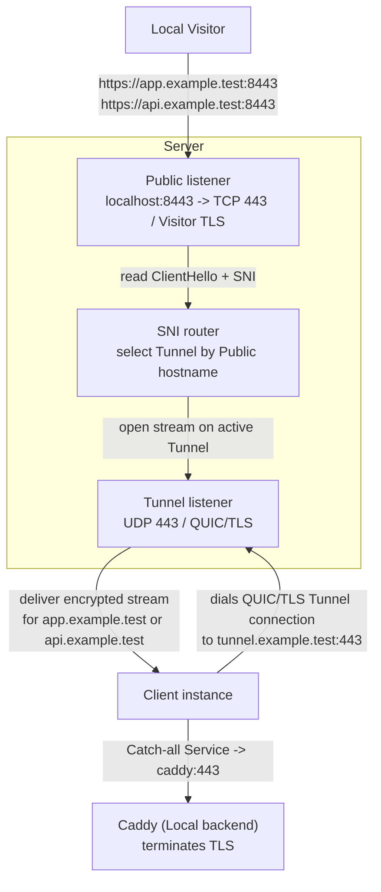

# Docker example

This is the fastest way to see Runewarp working end to end. It runs one server, one client, one tunnel, and a catch-all service that forwards both `app.example.test` and `api.example.test` to Caddy.

## What you'll verify

- the Server routes only explicit **Public hostnames**
- the Client uses one sole **Catch-all Service**
- public TLS stays opaque to Runewarp and is terminated by the backend
- the manual/private-CA Server path and Client identity provisioning work in a containerized environment

## Topology



The example uses:

- `tunnel.example.test` as the **Server hostname**
- `app.example.test` and `api.example.test` as the routed **Public hostnames**
- Caddy as the TLS-terminating **Local backend**

## Prerequisites

- Docker
- Docker Compose
- Ruby
- `curl`

## Prepare the example

From the repository root:

```bash
./scripts/docker-example prepare
```

`./scripts/docker-example prepare`:

- builds the local `runewarp/runewarp:local` image
- runs `runewarp server cert init --hostname tunnel.example.test` inside that image with `XDG_DATA_HOME=/workspace/generated/server/source-data`
- runs `runewarp client identity init` inside that image with `XDG_DATA_HOME=/workspace/generated/client/source-data`
- copies the generated certificate, identity, and trust material into the read-only runtime trees under `examples/docker/generated/server` and `examples/docker/generated/client`
- renders XDG-style runtime config and data trees under `examples/docker/generated/server`, `examples/docker/generated/client`, and `examples/docker/generated/caddy`, so the containers use default config discovery plus default material and trust paths inside the example

The Compose file uses that locally built `runewarp/runewarp:local` image for both the server and client. It does not pull a published image from Docker Hub.

If you want to do the same setup manually instead of using the helper script, run the equivalent steps from the repository root:

```bash
docker build --file Dockerfile --tag runewarp/runewarp:local .

mkdir -p \
  examples/docker/generated/server/source-data/runewarp/server/cert/state \
  examples/docker/generated/server/data/runewarp/server/cert \
  examples/docker/generated/server/config/runewarp \
  examples/docker/generated/client/source-data/runewarp/client/identity \
  examples/docker/generated/client/data/runewarp/client/identity \
  examples/docker/generated/client/data/runewarp/client \
  examples/docker/generated/client/config/runewarp \
  examples/docker/generated/caddy/data \
  examples/docker/generated/caddy/config

docker run --rm \
  --user "$(id -u):$(id -g)" \
  --volume "$PWD/examples/docker:/workspace" \
  --env XDG_DATA_HOME=/workspace/generated/server/source-data \
  runewarp/runewarp:local \
  server cert init --hostname tunnel.example.test

docker run --rm \
  --user "$(id -u):$(id -g)" \
  --volume "$PWD/examples/docker:/workspace" \
  --env XDG_DATA_HOME=/workspace/generated/client/source-data \
  runewarp/runewarp:local \
  client identity init

cp examples/docker/generated/server/source-data/runewarp/server/cert/server.crt \
  examples/docker/generated/server/data/runewarp/server/cert/server.crt
cp examples/docker/generated/server/source-data/runewarp/server/cert/server.key \
  examples/docker/generated/server/data/runewarp/server/cert/server.key
cp examples/docker/generated/server/source-data/runewarp/server/cert/server-ca.crt \
  examples/docker/generated/server/data/runewarp/server/cert/server-ca.crt
cp examples/docker/generated/client/source-data/runewarp/client/identity/client.crt \
  examples/docker/generated/client/data/runewarp/client/identity/client.crt
cp examples/docker/generated/client/source-data/runewarp/client/identity/client.key \
  examples/docker/generated/client/data/runewarp/client/identity/client.key
cp examples/docker/generated/client/source-data/runewarp/client/identity/client-identity.txt \
  examples/docker/generated/client/data/runewarp/client/identity/client-identity.txt
cp examples/docker/generated/server/source-data/runewarp/server/cert/server-ca.crt \
  examples/docker/generated/client/data/runewarp/client/server-ca.crt

client_identity="$(tr -d '[:space:]' < examples/docker/generated/client/source-data/runewarp/client/identity/client-identity.txt)"
sed "s/__CLIENT_IDENTITY__/${client_identity}/" \
  examples/docker/server/config.toml.template \
  > examples/docker/generated/server/config/runewarp/config.toml
cp examples/docker/client/config.toml.template \
  examples/docker/generated/client/config/runewarp/config.toml
```

Those commands are the manual equivalent of the helper script: they build the image, generate the Server certificate and Client identity with the real `runewarp` CLI, then stage the runtime files where Compose mounts them read-only.

Use `./scripts/docker-example prepare --reset` when you want to discard generated state and rebuild it cleanly.

## Start the stack

```bash
docker compose -f examples/docker/docker-compose.yml up -d
```

The stack contains:

- `server`: the public Runewarp **Server**
- `client`: the Runewarp **Client**
- `caddy`: the TLS-terminating backend

The example publishes the Server on `localhost:8443` for local testing while the Client reaches the Server over the Docker network.

## Verify the example

The quickest end-to-end verification is:

```bash
./scripts/docker-example smoke
```

`./scripts/docker-example smoke` resets the stack, prepares fresh state, starts the containers, waits for Caddy's local CA, verifies both hostnames over TLS, and then shuts the stack back down.

If you want to keep the stack running and inspect it manually:

```bash
curl --cacert examples/docker/generated/caddy/root.crt \
  --resolve app.example.test:8443:127.0.0.1 \
  https://app.example.test:8443/

curl --cacert examples/docker/generated/caddy/root.crt \
  --resolve api.example.test:8443:127.0.0.1 \
  https://api.example.test:8443/
```

## Reset and cleanup

```bash
docker compose -f examples/docker/docker-compose.yml down --volumes --remove-orphans
./scripts/docker-example prepare --reset
```

## Where to go next

- [`docs/usage.md`](../../docs/usage.md) for the operator workflow
- [`docs/configuration.md`](../../docs/configuration.md) for config shapes and key reference
- [`docs/architecture.md`](../../docs/architecture.md) for the routing model behind this example
