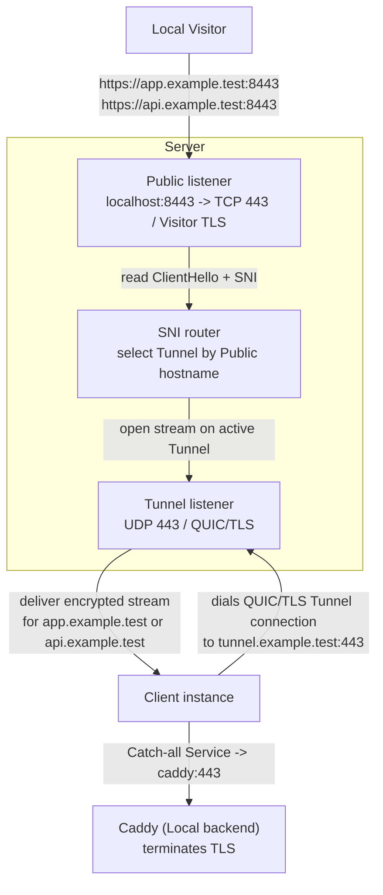

# Docker example

This is the fastest way to see Runewarp working end to end. It runs one server, one client, one tunnel, and a catch-all service that forwards both `app.example.test` and `api.example.test` to Caddy.

## What you'll verify

- the Server routes only explicit **Public hostnames**
- the Client uses one sole **Catch-all Service**
- public TLS stays opaque to Runewarp and is terminated by the backend
- the manual/private-CA Server path and Client identity provisioning work in a containerized environment

## Topology



The example uses:

- `tunnel.example.test` as the **Server hostname**
- `app.example.test` and `api.example.test` as the routed **Public hostnames**
- Caddy as the TLS-terminating **Local backend**

## Prerequisites

- Docker
- Docker Compose
- Ruby
- `curl`

## Prepare the example

From the repository root:

```bash
./scripts/docker-example prepare
```

`./scripts/docker-example prepare`:

- builds the local `runewarp/runewarp:local` image
- runs `runewarp server cert init --hostname tunnel.example.test` inside a short-lived container with its own writable `XDG_DATA_HOME`
- runs `runewarp client identity init` inside a short-lived container with its own writable `XDG_DATA_HOME`
- copies only the runtime certificate, identity, and trust material into the read-only trees under `examples/docker/generated/server` and `examples/docker/generated/client`
- normalizes those runtime files for the distroless `nonroot` containers used by the example, so the stack boots cleanly on Linux CI without keeping extra staging trees in the repository
- renders XDG-style runtime config and data trees under `examples/docker/generated/server`, `examples/docker/generated/client`, and `examples/docker/generated/caddy`, so the containers use default config discovery plus default material and trust paths inside the example

The Compose file defaults to the locally built `runewarp/runewarp:local` image for both the server and client.

To smoke a published image instead, pass `--image-ref`:

```bash
./scripts/docker-example smoke --image-ref docker.io/runewarp/runewarp:<12-char-commit>
```

That path reuses the same generated runtime material and Compose stack, but points both Runewarp services at the published image instead of the local build.

This helper is intentionally example-specific. For a normal operator setup, run `runewarp server cert init --hostname ...` on the machine that will run the Server and `runewarp client identity init` on the machine that will run the Client, then place the resulting material in the usual config and data locations described in [`docs/usage.md`](../../docs/usage.md) and [`docs/configuration.md`](../../docs/configuration.md). The example helper just stages those same artifacts into `examples/docker/generated` so Compose can mount them read-only.

Use `./scripts/docker-example prepare --reset` when you want to discard generated state and rebuild it cleanly.

## Start the stack

```bash
docker compose -f examples/docker/docker-compose.yml up -d
```

The stack contains:

- `server`: the public Runewarp **Server**
- `client`: the Runewarp **Client**
- `caddy`: the TLS-terminating backend

The example publishes the Server on `localhost:8443` for local testing while the Client reaches the Server over the Docker network.

## Verify the example

The quickest end-to-end verification is:

```bash
./scripts/docker-example smoke
```

`./scripts/docker-example smoke` resets the stack, prepares fresh state, starts the containers, waits for Caddy's local CA, verifies both hostnames over TLS, and then shuts the stack back down. Add `--image-ref docker.io/runewarp/runewarp:<tag>` when you want the same end-to-end proof against a published image lineage.

If you want to keep the stack running and inspect it manually:

```bash
curl --cacert examples/docker/generated/caddy/root.crt \
  --resolve app.example.test:8443:127.0.0.1 \
  https://app.example.test:8443/

curl --cacert examples/docker/generated/caddy/root.crt \
  --resolve api.example.test:8443:127.0.0.1 \
  https://api.example.test:8443/
```

## Reset and cleanup

```bash
docker compose -f examples/docker/docker-compose.yml down --volumes --remove-orphans
./scripts/docker-example prepare --reset
```

## Where to go next

- [`docs/usage.md`](../../docs/usage.md) for the operator workflow
- [`docs/configuration.md`](../../docs/configuration.md) for config shapes and key reference
- [`docs/architecture.md`](../../docs/architecture.md) for the routing model behind this example
