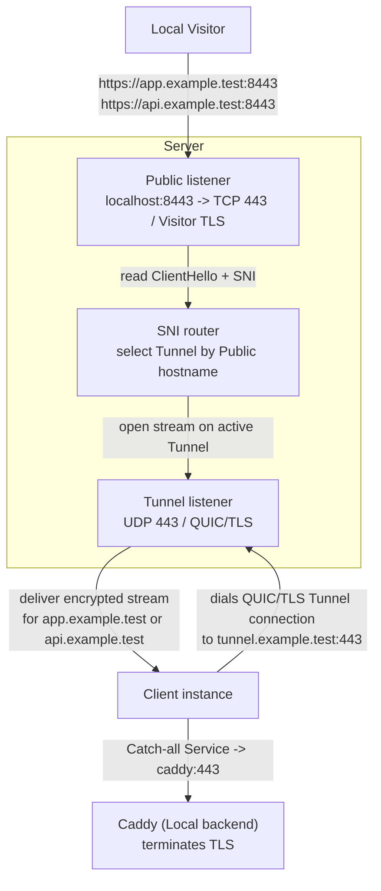

# Docker example

This is the fastest way to see Runewarp working end to end. It runs one server, one client, one tunnel, and a catch-all service that forwards both `app.example.test` and `api.example.test` to Caddy.

## What you'll verify

- the Server routes only explicit **Public hostnames**
- the Client uses one sole **Catch-all Service**
- public TLS stays opaque to Runewarp and is terminated by the backend
- the manual/private-CA Server path and Client identity provisioning work in a containerized environment

## Topology



The example uses:

- `tunnel.example.test` as the **Server hostname**
- `app.example.test` and `api.example.test` as the routed **Public hostnames**
- Caddy as the TLS-terminating **Local backend**

## Prerequisites

- Docker
- Docker Compose
- Ruby
- `curl`

## Prepare the example

From the repository root:

```bash
cd examples/docker
ruby ./prepare.rb
```

`ruby ./prepare.rb`:

- builds the local `runewarp/runewarp:local` image
- generates manual/private-CA Server material under `generated/server/source-data/runewarp/server/cert`
- generates Client identity material under `generated/client/source-data/runewarp/client/identity`
- renders XDG-style runtime config and data trees under `generated/server`, `generated/client`, and `generated/caddy`, so the containers use default config discovery plus default material and trust paths inside the example

The Compose file uses that locally built `runewarp/runewarp:local` image for both the server and client. It does not pull a published image from Docker Hub.

Use `ruby ./prepare.rb --reset` when you want to discard generated state and rebuild it cleanly.

## Start the stack

```bash
docker compose up -d
```

The stack contains:

- `server`: the public Runewarp **Server**
- `client`: the Runewarp **Client**
- `caddy`: the TLS-terminating backend

The example publishes the Server on `localhost:8443` for local testing while the Client reaches the Server over the Docker network.

## Verify the example

The quickest end-to-end verification is:

```bash
ruby ./smoke.rb
```

`ruby ./smoke.rb` resets the stack, prepares fresh state, starts the containers, waits for Caddy's local CA, verifies both hostnames over TLS, and then shuts the stack back down.

If you want to keep the stack running and inspect it manually:

```bash
curl --cacert ./generated/caddy/root.crt \
  --resolve app.example.test:8443:127.0.0.1 \
  https://app.example.test:8443/

curl --cacert ./generated/caddy/root.crt \
  --resolve api.example.test:8443:127.0.0.1 \
  https://api.example.test:8443/
```

## Reset and cleanup

```bash
docker compose down --volumes --remove-orphans
ruby ./prepare.rb --reset
```

## Where to go next

- [`docs/usage.md`](../../docs/usage.md) for the operator workflow
- [`docs/configuration.md`](../../docs/configuration.md) for config shapes and key reference
- [`docs/architecture.md`](../../docs/architecture.md) for the routing model behind this example
